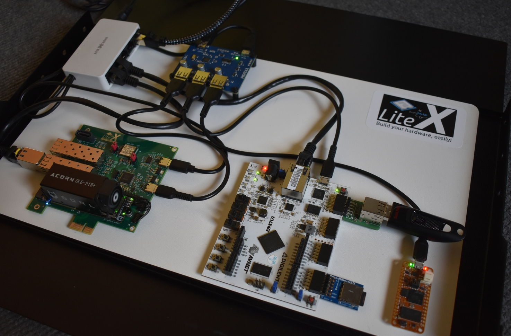
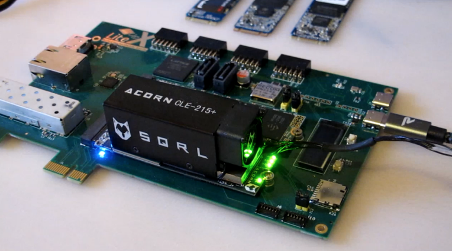

```
                                 __   _ __      _  __    __ ___      __    _________
                                / /  (_) /____ | |/_/___/ // / | /| / /___/ ___/  _/
                               / /__/ / __/ -_)>  </___/ _  /| |/ |/ /___/ /___/ /
                              /____/_/\__/\__/_/|_|   /_//_/ |__/|__/    \___/___/
                                     Copyright (c) 2024, EnjoyDigital
                                    LiteX Hardware Continous-Integration
```


<p align="center"></p>

[> Intro
--------

This project provides an environment to complement software CI tests on hardware boards. It offers
scripts and tools to easily define configurations for testing, compile them, compile software (baremetal,
OSes), and then load and test them on hardware.

Initially developed for LiteX Hardware CI tests, this framework is designed to be generic enough for
reuse in other Hardware/FPGA projects. Its focus is on simplicity and ease of use.

<p align="center">
  
  
</p>


[> Testing process.
-------------------

The LiteX CI framework is designed to make testing FPGA designs straightforward and efficient.
Here's a step-by-step breakdown of how it works:

- **Compile Gateware and Software**: First, the Host PC compiles the FPGA's gateware (the hardware
  description) and the software that will run on it. This is like preparing everything you need
  before starting an experiment.

- **Prepare the Hardware Setup**: Next, the testing setup is prepared. This involves making sure the
  FPGA board is powered on and connected to the Host PC. It's akin to setting up your workspace
  with all the tools and materials you need.

- **Load FPGA Configuration and Software**: Then, the FPGA configuration is loaded onto the board,
  followed by the software. This step is like running your experiment with the prepared materials.

- **Monitor and Interact**: Once everything is loaded, the system interacts with the FPGA board through
  a serial port to monitor its performance and behavior. It's like observing the results of your
  experiment and taking notes.

- **Generate Reports**: Finally, after the tests are complete, a report is generated. This report
  details the test outcomes, helping to understand how well the FPGA design performed. It's similar
  to summarizing the results of your experiment in a report.

[> Running a Configuration File with LiteX HW CI.
-------------------------------------------------

To run a test with the LiteX HW CI framework, you'll start by executing the litex_hw_ci.py script,
specifying the configuration file that outlines your test setup. For example:
```sh
python litex_hw_ci.py --config your_configuration_file.py
```

will kick off the process. This script follows the instructions laid out in the configuration file,
which includes compiling the necessary gateware and software, preparing the hardware setup
(utilizing YKUSH kits for USB connectivity), and then loading the FPGA configuration and software
onto the target board.

Upon completion of the tests, the LiteX HW CI framework generates a comprehensive HTML report. This
report details the outcomes of each test, including any successes and failures. Additionally, all
relevant data, such as test logs, software versions, and gateware binaries, are archived. This
archive serves as a valuable resource for future reference, allowing developers to track changes
over time, identify regressions quickly, and facilitate a smoother debugging and validation
process.


[> Creating a configuration file.
---------------------------------

Configuration files are central to the LiteX Hardware Continuous Integration process, allowing for
the definition of test environments tailored to specific hardware targets and software
configurations. Below is a guide on how to create and customize these configuration files.

# Configuration File Structure

Each configuration file is a Python script that imports the LiteXCIConfig class from the litex_hw_ci
module and defines a dictionary of configurations. Each key in the dictionary represents a unique
configuration name, and the value is an instance of LiteXCIConfig containing the configuration
details.

#### Key Components

- **`target`**: Identifies the hardware board for the tests.
- **`gateware_command`**: Specifies command-line arguments for compiling the gateware, including CPU
    type and RAM size.
- **`setup_command`** and **`exit_command`**: Commands executed before and after the test, usually
    for managing board power and connectivity via `ykushcmd`.
- **`tty`**: The serial port for communication with the FPGA board.

### Example Configuration: TrellisBoard with SERV CPU

```python
from litex_hw_ci import LiteXCIConfig

litex_ci_configs = {
    "trellisboard:serv" : LiteXCIConfig(
        target           = "trellisboard",
        gateware_command = "--cpu-type=serv --integrated-main-ram-size=0x100",
        setup_command    = "ykushcmd -d a && ykushcmd -u 1",
        exit_command     = "ykushcmd -d a",
        tty              = "/dev/ttyUSB1",
    ),
}
```
This configuration sets up a test for the TrellisBoard with a SERV CPU. It specifies:

- `trellisboard:serv`: A unique identifier for this test setup.
- `gateware_command`: Commands for building the gateware with a SERV CPU and a main RAM size of 256
  bytes (0x100).
- `setup_command` and `exit_command`: Prepare the board for testing and reset the environment
  afterward using ykushcmd.
- `tty`: Uses /dev/ttyUSB1 for serial communication, crucial for software loading and test
  execution.


[> YKUSH Kits.
--------------

YKUSH kits play a crucial role in simplifying the hardware testing process within the LiteX HW CI
framework. By allowing us to connect and manage multiple FPGA boards through a single host PC,
YKUSH kits eliminate the need to assign specific USB aliases to each board. This flexibility
significantly streamlines the process of loading FPGA configurations and managing TTY control and
monitoring. With a YKUSH kit, only the board under test is connected at any given time, enhancing
the efficiency and reliability of the testing workflow.

<p align="center">
  
</p>

## Compiling and Installing YKUSH Software

To take full advantage of YKUSH kits for hardware testing, the ykushcmd command-line tool needs to
be compiled and installed on the host system. Here are the steps to compile and install the
software:

```sh
$ git clone https://github.com/Yepkit/ykush.git
$ cd ykush
$ make
$ sudo mv bin/ykushcmd /usr/local/bin
```

[> Acknowledgments.
-------------------
This work has been supported by NLNet, whose funding has significantly contributed to the
development and enhancement of this project. We're grateful for their support in making this
initiative possible.

<p align="center">
  
</p>

[> Enjoy :)
-----------

Your LiteX HW CI setup with YKUSH kits should be ready, making FPGA testing efficient and
straightforward. Dive into your projects and consider sharing your progress with the community.

Happy testing!

<p align="center"></p>
